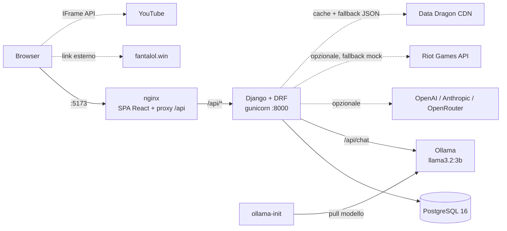

# RiftHub

**RiftHub** è una piattaforma gestionale full stack per team, accademie e giocatori del **League of Legends competitivo**. Riunisce in un'unica webapp:

1. **Gestore automatico di Scrim e Tornei** — matchmaking per compatibilità (orari con timezone, rank medio, regione/tier, varietà degli avversari), bracket a eliminazione diretta con bye e seeding standard, gironi all'italiana con classifica.
2. **Marketplace di Talent Scouting e Statistiche Avanzate** — deck "swipe" stile Tinder (drag, pulsanti, frecce ←/→), match reciproco team↔player con chat, filtri avanzati e confronto radar fra due player, import statistiche dalla Riot API (con mock automatico).
3. **Shadow Coaching e Replay Overlay** — lavagna tattica su una mappa di Summoner's Rift disegnata in SVG, frame animati, sessioni live coach → player (polling ogni 2 s) e sovrapposizione dei frame a un VOD.
4. **Coaching e Analisi VOD** — player YouTube con commenti a timestamp (click = seek), filtri, report AI strutturato, sessioni di coaching con homework e action item.
5. **Collegamento a FantaLol** — link esterno a [fantalol.win](https://fantalol.win) (nessuna integrazione API).

In più: **assistente AI agentico** con tool-calling sui dati reali (player, scrim, VOD) e **draft advisor**, su LLM locale (Ollama) o provider online.

### Architettura



---

## Uso del repository

### Prerequisiti

- **Docker ≥ 24** con **Compose v2** (è tutto ciò che serve per avviare il sistema).
- Solo per sviluppo locale senza Docker: Python 3.12, Node 20+, PostgreSQL 16 (opzionale: senza `POSTGRES_HOST` il backend usa SQLite), Ollama.

### Setup rapido

```bash
cp .env.example .env
docker compose up --build
```

| Servizio | URL |
|---|---|
| Frontend | http://localhost:5173 |
| API | http://localhost:8000/api/ (anche via proxy: http://localhost:5173/api/) |
| Swagger UI | http://localhost:8000/api/docs/ |
| Schema OpenAPI | http://localhost:8000/api/schema/ |
| Django admin | http://localhost:8000/admin/ (`admin@rifthub.dev`) |
| Ollama | http://localhost:11434 |

Il compose funziona anche senza `.env` (valori di default), ma copiare `.env.example` è consigliato.

### Tempi e risorse

- Il primo avvio scarica le immagini Docker (~2 GB con Ollama) e il modello **`llama3.2:3b` (~2,0 GB)**. Servono circa **4 GB di RAM libera** per il modello (8 GB consigliati per `qwen2.5:7b`, ~4,7 GB su disco).
- L'applicazione è utilizzabile subito: finché il modello non è pronto le funzioni AI rispondono con un errore gestito (`503 Provider AI non raggiungibile` e messaggio "modello non ancora disponibile").
- Stato del download: `docker compose logs -f ollama-init` (termina con "Modello pronto.").
- Senza GPU una risposta dell'agente richiede tipicamente 10–40 s (la prima è più lenta perché carica il modello; timeout configurabile con `AI_TIMEOUT`).
- **CPU ibride (Intel Core Ultra / 12ª gen+, core P/E):** lasciare a Ollama tutti i core logici può renderlo 20–30 volte più lento. `OLLAMA_NUM_THREAD` (default `8` in `.env.example`) limita i thread: su un Core Ultra 7 255H si passa da ~0,7 a ~18 token/s.

### Credenziali demo

Password per tutti: **`Demo1234!`**

| Email | Ruolo | Note |
|---|---|---|
| `admin@rifthub.dev` | ADMIN | superuser Django, organizzatore di "Winter Clash 2026" |
| `manager@rifthub.dev` | MANAGER | owner di **Nova Academy**, organizzatore di "Rift Academy Cup" e "Lega Accademie EUW" |
| `coach@rifthub.dev` | COACH | coach di Nova Academy, reviewer delle VOD, coach della shadow session |
| `player@rifthub.dev` | PLAYER | mid laner di Nova Academy, player della shadow session, studente di coaching |
| `scout@rifthub.dev` | SCOUT | può modificare le player card |

### Percorso guidato

1. **Login** come `manager@rifthub.dev` → la **Dashboard** mostra prossime scrim, tornei, match di scouting, VOD e la card FantaLol.
2. **Scrim** → sulla richiesta aperta di Nova Academy premi **"Trova avversario"** (candidati con score 0–100, dettaglio dei 4 criteri e motivazioni) → **"Auto-match"** crea la scrim con il migliore; la vedi nel calendario settimanale.
3. **Tornei** → "Rift Academy Cup" (6 iscritti) → **Genera bracket** (8 slot, bye automatici ai seed 1–2) → clicca un match per inserire il risultato: il vincitore avanza. "Lega Accademie EUW" mostra girone e classifica; "Winter Clash 2026" è già in corso.
4. **Scouting** → il deck di Nova mostra per primi i support (ruolo scoperto). Il primo **❤️** (o freccia →, o trascinamento a destra) su *Volt* fa scattare **un match** → **Match** → chat. In **Sfoglia** filtra, seleziona due player per il **radar comparativo**, apri una card per **Importa da Riot** e **Profilo AI**.
5. **Tattiche** → apri "Invade lv1 (lato blu)" → sposta token, aggiungi ward/frecce/cerchi/testo, **Salva frame**, premi **▶** per animare i frame.
6. **VOD** → "Scrim vs Aurora – G3" → clicca un commento per saltare al timestamp, aggiungi un commento al tempo corrente, **Genera report AI**. Il pannello **Replay overlay** mostra la lavagna collegata al tempo giusto.
7. **Shadow session con due browser**: browser A come `coach@rifthub.dev` → Tattiche → "Shadow session aperte" → Entra; browser B (o finestra anonima) come `player@rifthub.dev` → stessa sessione. Il coach cambia frame o sposta token e salva: il player vede l'aggiornamento entro 2 s.
8. **Assistente AI** → chiedi "Cercami dei support almeno Diamond in EUW che cercano team": la risposta mostra i **tool usati** con argomenti e risultato.

### Variabili d'ambiente

| Variabile | Obbligatoria | Default | Descrizione |
|---|---|---|---|
| `DJANGO_SECRET_KEY` | consigliata | casuale per processo | Chiave segreta Django (in produzione: stringa lunga e casuale) |
| `DJANGO_DEBUG` | no | `0` | `1` solo in sviluppo |
| `ALLOWED_HOSTS` | no | `localhost,127.0.0.1,backend` | Host accettati |
| `CORS_ALLOWED_ORIGINS` | no | `http://localhost:5173` | Origini CORS (non servono con il proxy nginx) |
| `SEED_DEMO` | no | `0` (`1` in `.env.example`) | Carica i dati demo all'avvio (idempotente) |
| `POSTGRES_DB` / `POSTGRES_USER` / `POSTGRES_PASSWORD` | no | `rifthub` | Credenziali database |
| `POSTGRES_HOST` / `POSTGRES_PORT` | no | `db` / `5432` | Se `POSTGRES_HOST` è vuoto il backend usa SQLite |
| `AI_PROVIDER` | no | `ollama` | `ollama`, `openai`, `anthropic`, `openrouter`, `fake` |
| `AI_MODEL` | no | default del provider | `llama3.2:3b`, `qwen2.5:7b`, `gpt-4o-mini`, `claude-opus-5-5`, … |
| `OLLAMA_BASE_URL` | no | `http://ollama:11434` | Endpoint Ollama |
| `OLLAMA_NUM_THREAD` | no | automatico (`8` in `.env.example`) | Thread CPU per Ollama: sulle CPU ibride (core P/E) usa il numero di core "performance" |
| `OLLAMA_KEEP_ALIVE` | no | `30m` | Per quanto tempo il modello resta in RAM dopo l'ultima richiesta |
| `AI_TIMEOUT` | no | `120` | Timeout (s) di ogni chiamata al provider |
| `OPENAI_API_KEY` / `ANTHROPIC_API_KEY` / `OPENROUTER_API_KEY` | solo per quel provider | — | Chiavi dei provider online |
| `RIOT_API_KEY` | no | — | Chiave Riot; senza si usa il mock deterministico |

### Cambiare provider AI

Modifica `.env` e riavvia il backend (`docker compose up -d backend`):

```bash
# Ollama (default, locale e gratuito)
AI_PROVIDER=ollama
AI_MODEL=llama3.2:3b        # oppure qwen2.5:7b (tool-calling migliore, più RAM)

# OpenAI
AI_PROVIDER=openai
AI_MODEL=gpt-4o-mini
OPENAI_API_KEY=sk-...

# Anthropic (SDK ufficiale `anthropic`)
AI_PROVIDER=anthropic
AI_MODEL=claude-opus-5-5
ANTHROPIC_API_KEY=sk-ant-...

# OpenRouter (API compatibile OpenAI)
AI_PROVIDER=openrouter
AI_MODEL=openai/gpt-4o-mini
OPENROUTER_API_KEY=sk-or-...
```

Ricorda di aggiornare anche `AI_MODEL` (o lasciarlo vuoto per il default del provider). Per un modello Ollama diverso, cambia `AI_MODEL` e riesegui `docker compose up -d ollama-init`. `AI_PROVIDER=fake` risponde offline con testi simulati (usato dai test, utile per demo senza LLM).

### Riot API con chiave reale

1. Crea una chiave su https://developer.riotgames.com. **Le development key scadono ogni 24 ore**: rigenerale dal portale.
2. Imposta `RIOT_API_KEY=RGAPI-...` in `.env` e riavvia il backend.
3. Il nickname della player card deve essere un Riot ID (`Nome#TAG`, es. `Faker#KR1`) e la regione quella corretta.
4. **Importa da Riot** usa `account-v1` → `league-v4` → `match-v5` (ultime 10 ranked solo) e calcola winrate, KDA, CS/min, oro/min, quota danni, visione/min, kill participation e first blood. In caso di errore (chiave scaduta, Riot ID inesistente, rate limit) si ripiega sul mock e la risposta lo indica (`source: "mock"`).

### Sviluppo locale senza Docker

```bash
# Backend
cd backend
python3.12 -m venv .venv && source .venv/bin/activate
pip install -r requirements.txt
export DJANGO_DEBUG=1 AI_PROVIDER=fake     # senza POSTGRES_HOST usa SQLite
python manage.py migrate
python manage.py seed_demo
python manage.py runserver                  # http://localhost:8000

# Frontend (altro terminale)
cd frontend
npm install
npm run dev                                 # http://localhost:5173, proxy /api → :8000
```

Per usare Postgres locale esporta `POSTGRES_HOST=localhost` (più DB/USER/PASSWORD); per Ollama locale `AI_PROVIDER=ollama OLLAMA_BASE_URL=http://localhost:11434`.

### Test, lint, migrazioni

```bash
# Backend (dalla cartella backend/)
pytest                              # 50 test: matchmaking, bracket, scouting, permessi, agente AI...
ruff check .
python manage.py makemigrations --check --dry-run

# Frontend (dalla cartella frontend/)
npm test                            # vitest: render App, redirect ProtectedRoute, deck swipe, QueryState
npm run lint
npm run build

# Con Docker
docker compose exec backend pytest
docker compose exec backend python manage.py makemigrations
docker compose exec backend python manage.py migrate
docker compose config -q            # valida il compose
```

**Reset del DB e re-seed:**

```bash
docker compose down -v              # elimina anche i volumi (DB e modelli Ollama!)
docker compose up --build
# oppure, mantenendo il modello Ollama:
docker compose rm -sf db backend && docker volume rm rifthub_pgdata && docker compose up -d
# re-seed manuale (idempotente, non duplica nulla):
docker compose exec backend python manage.py seed_demo
```

### Struttura del repository

```
├── docker-compose.yml, .env.example
├── backend/
│   ├── entrypoint.sh          # attende il DB → migrate → collectstatic → seed_demo → gunicorn
│   ├── config/                # settings (tutto da env), urls
│   └── apps/
│       ├── accounts/          # User custom (login via email), ruoli, JWT, /auth/me
│       ├── teams/             # Team, Membership, roster
│       ├── scrims/            # disponibilità, richieste, scrim, tornei
│       │   └── services/      # matchmaking.py e bracket.py (puro Python), finder.py/tournament.py (DB)
│       ├── scouting/          # PlayerCard, stats, swipe, match, chat, rank ↔ score
│       ├── tactics/           # lavagne, frame, elementi, shadow session, replay overlay
│       ├── coaching/          # VOD, commenti, sessioni, action item
│       ├── ai/                # providers/ (ollama, openai_compat, anthropic, fake), services, agent, prompts
│       ├── riot/              # client Riot + mock, Data Dragon + fallback JSON
│       └── core/              # permessi, paginazione, health, seed_demo
└── frontend/
    ├── nginx.conf             # SPA + proxy /api → backend
    └── src/
        ├── api/client.js      # axios + refresh JWT automatico
        ├── context/           # AuthContext
        ├── components/        # Navbar, ui (Card, Modal...), Bracket, SwipeDeck, BoardCanvas, BoardEditor...
        ├── pages/             # una pagina per sezione
        └── lib/               # formattazione, hook, interpolazione frame
```

### Panoramica API (prefisso `/api/`)

Tutto è protetto da JWT (`Authorization: Bearer <access>`) tranne `auth/register`, `auth/login`, `auth/refresh`, `health`. Le liste sono paginate (`?page=`, `?page_size=` fino a 200). Documentazione completa su **/api/docs/**.

| Area | Endpoint principali |
|---|---|
| Auth | `POST auth/register/`, `POST auth/login/` (`email`, `password`), `POST auth/refresh/`, `GET/PATCH auth/me/`, `GET health/` |
| Team | CRUD `teams/`, `GET teams/mine/`, `GET/POST/DELETE teams/{id}/members/` |
| Scrim | CRUD `availability/`, `scrim-requests/`, `POST scrim-requests/{id}/find-matches/`, `POST scrim-requests/{id}/auto-match/`, CRUD `scrims/`, `POST scrims/{id}/report-result/` |
| Tornei | CRUD `tournaments/`, `POST tournaments/{id}/register/`, `POST tournaments/{id}/generate-bracket/`, `GET tournaments/{id}/bracket/`, `GET tournaments/{id}/standings/`, `POST tournament-matches/{id}/report-result/` |
| Scouting | `GET scouting/cards/` (filtri `role`, `region`, `rank_min`, `rank_max`, `looking_for_team`, `champion`, `ordering`), `GET scouting/cards/{id}/compare/?with=`, `POST scouting/cards/{id}/import-riot/`, `GET scouting/deck/?team=`, `POST scouting/swipe/`, `POST scouting/player-swipe/`, `GET scouting/matches/`, `GET/POST scouting/matches/{id}/messages/` |
| Tattiche | CRUD `tactic-boards/`, `GET/POST tactic-boards/{id}/frames/`, `POST tactic-boards/{id}/duplicate-frame/`, CRUD `tactic-frames/`, `GET/POST/PUT tactic-frames/{id}/elements/` (PUT = sostituzione completa), CRUD `shadow-sessions/`, `GET shadow-sessions/{id}/state/`, `POST shadow-sessions/{id}/set-frame/`, CRUD `replay-overlays/` |
| Coaching | CRUD `vod-reviews/`, `vod-comments/` (`?review=`, ordinati per timestamp), `coaching-sessions/`, `action-items/` |
| AI | `POST ai/vod-summary/`, `POST ai/scout-summary/`, `POST ai/draft-advice/`, `POST ai/agent/chat/`, `GET ai/status/` |
| Riot | `GET riot/champions/` |

**Permessi:** le letture sono aperte agli utenti autenticati (tranne chat di scouting, shadow session e coaching, visibili solo ai partecipanti); le scritture sui dati di un team sono consentite a owner, admin e membri attivi con ruolo manager/coach/analyst.

### Backend di terze parti e collegamenti

| Servizio | Come è collegato |
|---|---|
| **Riot Games API** | `apps/riot/client.py`: `RiotClient` (requests, header `X-Riot-Token`, cache 5 min, gestione `429` con `Retry-After`) usato solo se `RIOT_API_KEY` è impostata; altrimenti, o in caso di qualsiasi errore, `MockRiotClient` genera statistiche deterministiche dal nickname. |
| **Data Dragon** | `apps/riot/datadragon.py`: legge l'ultima versione da `versions.json` e i campioni da `champion.json` (`it_IT`), cache in memoria 12 h; se la CDN non risponde usa `apps/riot/data/champions.json` (60 campioni). Il frontend mostra le icone con fallback a cerchi colorati con iniziale. |
| **Ollama** | `apps/ai/providers/ollama.py`: `POST /api/chat` con `tools`. Se il modello non supporta i tool nativi l'agente passa al protocollo JSON testuale `{"tool": ..., "args": ...}`. Il modello viene scaricato dal servizio `ollama-init`. |
| **OpenAI / OpenRouter** | `apps/ai/providers/openai_compat.py`: Chat Completions compatibile (stesso client, `base_url` diverso). |
| **Anthropic** | `apps/ai/providers/anthropic.py`: SDK ufficiale `anthropic`, conversione dei messaggi `tool_use`/`tool_result`. |
| **YouTube** | IFrame API caricata dal browser solo nella pagina VOD (seek e tempo corrente). |
| **FantaLol** | **Solo link esterno** a https://fantalol.win (navbar, dashboard, pagina `/fantalol`) con `target="_blank" rel="noopener noreferrer"`. Nessuna API né scambio di dati. |

### Scelte progettuali (non specificate e risolte nel modo più semplice)

- **Login via email**: `User.USERNAME_FIELD = "email"`, quindi `POST /auth/login/` accetta `email` e `password`.
- **Rank numerico**: Iron IV = 0, +100 per divisione, +400 per tier (Diamond I = 2700), Master 2800, Grandmaster 2900, Challenger 3000.
- **Matchmaking**: candidati = team con una richiesta `OPEN`; sovrapposizione piena a 180 minuti settimanali; componente rank azzerata a 1000 punti di differenza (rank medio calcolato dalle player card del roster, 1500 se assenti); "varietà" azzerata con 3 scrim negli ultimi 30 giorni; esclusi i team con una scrim programmata entro ±3 h dall'orario richiesto. La scrim creata usa l'orario preferito della richiesta.
- **Tornei**: organizzatore = utente (con team organizzatore opzionale); 3 punti per vittoria, spareggi per differenza game e vittorie; pareggi non ammessi; un risultato non è modificabile se il match successivo è già stato giocato. Rigenerare il bracket azzera i risultati.
- **Fit score del deck**: 50 se il ruolo è scoperto nel roster (10 altrimenti) + 30 vicinanza/superiorità di rank rispetto al team + 10 se cerca team + 10 se ha già messo LIKE al team.
- **Seed**: Nova Academy ha volutamente il ruolo SUPPORT scoperto; oltre alle 30 player card del mercato vengono create le card dei giocatori dei roster (servono per il rank medio dei team). I video demo puntano a un video pubblico segnaposto: sostituiscili con VOD reali.
- **Conversazioni dell'agente**: salvate come `AIReport` (`AGENT_CHAT`), le ultime 6 battute vengono rimandate al modello come contesto.
- **Aggiornamento automatico**: ogni pagina ricarica i propri dati ogni 15 s e quando si torna sulla scheda del browser; dopo qualsiasi salvataggio tutti i dati vengono aggiornati. Un errore in una pagina viene mostrato nella pagina stessa senza bloccare la navigazione.
- **Iscrizione ai tornei**: la pagina del torneo elenca tutti i team presenti su RiftHub; l'organizzatore può iscrivere qualsiasi team, gli altri utenti solo i team che gestiscono.
- **Secret key**: nessun valore hardcoded; se manca ne viene generata una casuale all'avvio (gunicorn usa `--preload` così i worker la condividono).

### Troubleshooting

| Problema | Soluzione |
|---|---|
| **Porte occupate** (5173, 8000, 5432 interna, 11434) | Libera la porta o cambia il mapping in `docker-compose.yml` (es. `"8080:80"`). Se hai un Ollama locale sulla 11434, fermalo o rimuovi il mapping `ports` del servizio `ollama`. |
| **Ollama lento / senza GPU** | Imposta `OLLAMA_NUM_THREAD` al numero di core "performance" della CPU (misura con diversi valori: su CPU ibride fa una differenza enorme), usa `llama3.2:3b`, aumenta `AI_TIMEOUT`, oppure passa a un provider online. Con GPU NVIDIA installa `nvidia-container-toolkit` e decommenta il blocco `deploy` del servizio `ollama`. |
| **"Provider AI non raggiungibile"** | Il modello è ancora in download (`docker compose logs -f ollama-init`) o il provider non è configurato: controlla `GET /api/ai/status/`. |
| **Errori CORS** | Usa il frontend su :5173 (le chiamate passano dal proxy nginx, stessa origine). Se servi il frontend da un'altra origine aggiungila a `CORS_ALLOWED_ORIGINS`. |
| **DB non pronto** | L'entrypoint attende il DB e il compose usa l'healthcheck; se i log mostrano errori persistenti: `docker compose restart backend` o reset con `docker compose down -v`. |
| **400 Bad Request su host diverso** | Aggiungi l'host (es. IP della macchina) ad `ALLOWED_HOSTS`. |
| **Icone campioni mancanti** | Data Dragon non raggiungibile: si usa il fallback locale e i token mostrano l'iniziale. |
| **Video VOD non disponibile** | Modifica l'URL della VOD con un video YouTube pubblico. |

---

## Funzionalità da sviluppare in futuro

- WebSocket / **Django Channels** per lo shadow coaching realtime (al posto del polling).
- Import automatico dei replay **`.rofl`** e ricostruzione delle posizioni sulla lavagna.
- Integrazione **Discord** (bot, notifiche scrim) e sincronizzazione **calendari** (Google/iCal).
- **Notifiche** in-app ed email (match di scouting, risultati, sessioni di coaching).
- **Ranking Elo interno** delle scrim per un matchmaking ancora più preciso.
- **Ruoli e permessi granulari** per team (analyst in sola lettura, staff esterno, ecc.).
- **Analisi AI multimodale dei VOD** (frame del video + trascrizione del voice comms).
- Integrazione futura con **FantaLol** se esporrà delle API.
- **App mobile** (React Native) per swipe e notifiche.
- **CI/CD** (GitHub Actions: test, lint, build immagini) e **deploy in cloud** con HTTPS.

## Riferimenti utili

- Riot Developer Portal: https://developer.riotgames.com
- Riot API docs: https://developer.riotgames.com/apis
- Data Dragon: https://developer.riotgames.com/docs/lol#data-dragon
- Django: https://docs.djangoproject.com
- Django REST Framework: https://www.django-rest-framework.org
- drf-spectacular: https://drf-spectacular.readthedocs.io
- SimpleJWT: https://django-rest-framework-simplejwt.readthedocs.io
- Vite: https://vitejs.dev
- React: https://react.dev
- TailwindCSS: https://tailwindcss.com
- Recharts: https://recharts.org
- TanStack Query: https://tanstack.com/query
- Ollama: https://ollama.com — API: https://github.com/ollama/ollama/blob/main/docs/api.md
- Anthropic docs: https://docs.anthropic.com
- OpenAI docs: https://platform.openai.com/docs
- OpenRouter: https://openrouter.ai/docs
- Dati competitivi: Leaguepedia (https://lol.fandom.com) e Oracle's Elixir (https://oracleselixir.com)
- FantaLol: https://fantalol.win

## Disclaimer legale

RiftHub non è affiliato, sponsorizzato né approvato da Riot Games. League of Legends e Riot Games sono marchi o marchi registrati di Riot Games, Inc. La mappa di Summoner's Rift è una rappresentazione semplificata generata nel codice; icone e dati dei campioni provengono da Data Dragon secondo i termini di Riot Games.
