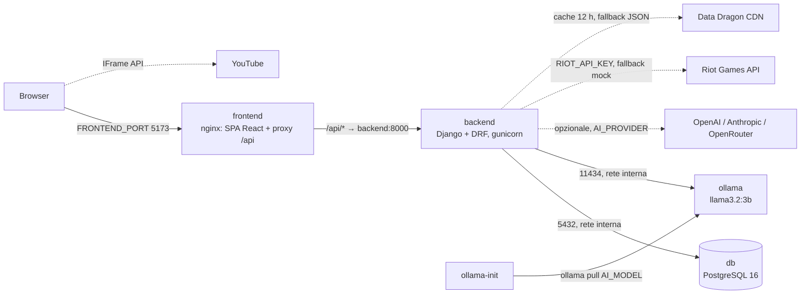

# Architettura di RiftHub

## Servizi (`docker-compose.yml`)

| Servizio | Immagine | Porta host | Healthcheck | Dipende da |
|---|---|---|---|---|
| `db` | `postgres:16-alpine` | nessuna (solo rete interna) | `pg_isready` | — |
| `backend` | `./backend` (python 3.12, utente `app`) | `BACKEND_PORT` (8000) | `GET /api/health/` | `db` healthy |
| `frontend` | `./frontend` (build Vite → nginx) | `FRONTEND_PORT` (5173) | — | `backend` healthy |
| `ollama` | `ollama/ollama` | `127.0.0.1:OLLAMA_PORT` (11434) | `ollama list` | — |
| `ollama-init` | `ollama/ollama` | — | — (esce dopo il pull) | `ollama` healthy |

Volumi: `pgdata` (database), `ollama_data` (modelli scaricati).

## Avvio del backend (`backend/entrypoint.sh`)

1. attende il DB (`manage.py check --database default`)
2. `migrate` → `collectstatic`
3. `seed_demo` se `SEED_DEMO=1` (idempotente)
4. `gunicorn` (3 worker, timeout 180 s, access log su stdout)

## Flusso di una richiesta AI

1. Il frontend chiama `POST /api/ai/agent/chat/` (JWT).
2. `apps/ai/views.py` → `agent.run_agent()` con il provider di `apps/ai/providers/factory.py`.
3. Il provider fa la chiamata HTTP con `post_with_retry` (`providers/base.py`): 3 tentativi su errori di connessione, 429 e 502–504, timeout `AI_TIMEOUT`.
4. Se il modello chiede un tool (`search_players`, `get_player_stats`, `find_scrim_opponents`, …), l'agente lo esegue sul DB e rimanda il risultato al modello.
5. Errore del provider → `503 {"detail": "Provider AI non raggiungibile", "error": "..."}`, loggato da `apps.ai`.

## API

Documentazione interattiva su `http://localhost:8000/api/docs/` (Swagger, drf-spectacular), schema su `/api/schema/`.
Panoramica degli endpoint nel [README](../README.md#panoramica-api-prefisso-api).
